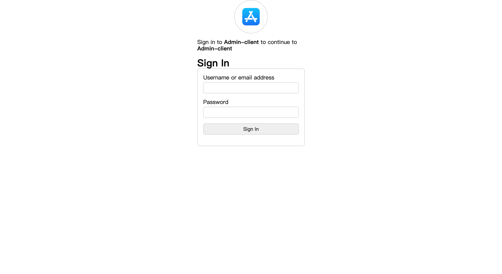
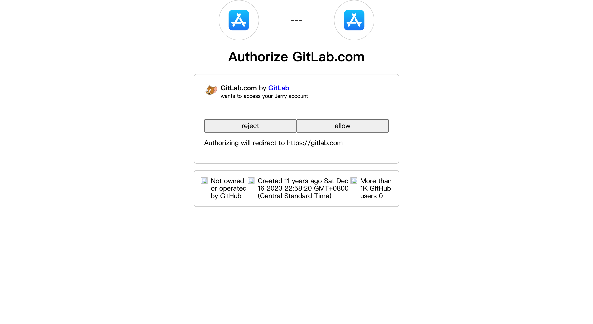

# Nodejs Oauth2.0 Server reference Github


## API

### authorization_code

#### GET /authorize

```
curl --location 'http://localhost:3000/oauth/authorize?response_type=code&client_id=f64d571f-0124-4947-b1de-711a5af405ee&redirect_uri=http%3A%2F%2Flocalhost%3A3000&scope=read&state=xyz'
```

#### POST /token

```
curl --location 'http://localhost:3000/oauth/token' \
--header 'Content-Type: application/x-www-form-urlencoded' \
--data-urlencode 'grant_type=authorization_code' \
--data-urlencode 'code=xxxxxxxx' \
--data-urlencode 'redirect_uri=http://example-app.com/redirect' \
--data-urlencode 'client_id=6113de587eb4554f83407345' \
--data-urlencode 'client_secret=xxxxxx'
```


### password

#### POST /token

```
curl --location 'http://127.0.0.1:3000/oauth/token' \
--header 'Content-Type: application/x-www-form-urlencoded' \
--data-urlencode 'grant_type=password' \
--data-urlencode 'client_id=f64d571f-0124-4947-b1de-711a5af405ee' \
--data-urlencode 'username=lossa.zhu@gmail.com' \
--data-urlencode 'password=123' \
--data-urlencode 'client_secret=xxx' \
--data-urlencode 'scope=read'
```

## Page

### Login


### Authorize




